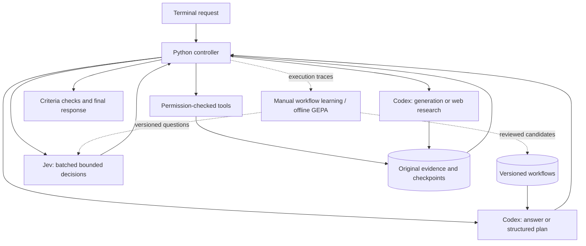

# Kestrel

A general-purpose terminal AI agent powered by Codex and Jev, with reusable workflows and configurable permissions for coding, research, and everyday tasks.

```text
  ◇  K E S T R E L
     Think deeply. Move lightly.

  Codex plans & creates · Jev decides · You control access

  ❯ Find the documents relevant to this question and compare them.

  ◌ Codex · thinking
  → Plan ready
  ◇ Jev · 3 decisions
  ↳ read_file · Read the selected source
  ✓ source · completed

  ready │ Codex default + Jev │ workspace │ Ctrl+C stop · /help
```

The terminal interface uses streamed activity, readable tool previews, Markdown responses, slash-command completion, a live status bar, and explicit permission prompts. It is inspired by familiar terminal assistants and has its own visual design.

**Status:** initial implementation. Tests, live provider calls, and interactive UI validation have deliberately **not been run**, at the repository owner's request. Package installation is not evidence of runtime correctness. See the [manual acceptance guide](docs/TESTING.md).

## Install

Requires macOS or Linux, Python 3.11+, and [uv](https://docs.astral.sh/uv/). No local model weights are downloaded.

```sh
git clone https://github.com/itsflownium/Kestrel-Agent.git
cd Kestrel-Agent
bash scripts/install.sh
kestrel auth login
kestrel auth jev
kestrel
```

Codex manages ChatGPT OAuth and token refresh. Existing sign-in is reused when available. Kestrel never extracts OAuth tokens or treats them as Platform API keys. The pinned official Python SDK includes its own Codex executable.

`kestrel auth jev` uses hidden terminal input and saves an owner-readable local secret file. Alternatively, set `TYPESAFE_API_KEY`. Never commit real keys or paste them into issues/PRs.

The installer adds `~/.local/bin/kestrel`. If needed, add `export PATH="$HOME/.local/bin:$PATH"` to your shell configuration. Installation does not run tests, sign in, or call models.

```sh
kestrel --workspace ~/Projects/example
kestrel resume SESSION_ID
```

## Architecture



- **Codex** creates plans, code, prose, and research. Simple conversation can finish in one generation call. The user selects a fixed model; there is no learned model router.
- **Jev** evaluates conditional action relevance, selects supplied candidates, checks explicit completion criteria, and judges whether final action claims match evidence. Independent questions are batched. Confidence is not treated as proof of correctness.
- **The controller** validates dependency graphs and result bindings, enforces permissions, parallelizes independent reads, serializes writes, tracks budgets, and checkpoints operations. Jev cannot change permissions.
- **Tools** include file listing/search, text editing with content-hash protection, PDF/DOCX/XLSX reading, sandboxed commands, public URL fetching, Codex web research, and configured MCP tools. Complex artifact creation uses explicitly authorized commands and suitable libraries.
- **Memory** retains original evidence, bounded prompt excerpts, sessions, and parameterized workflow recipes in SQLite. `read_evidence` retrieves retained detail. Workflows supplement fresh planning rather than limiting task types.
- **GEPA** evaluates better prompt wording offline. It does not train model weights or run automatically.

See [implementation notes](docs/ARCHITECTURE.md) for boundaries and recovery behavior.

## Access and budgets

```sh
kestrel config show
kestrel config set permission '"read-only"'
kestrel config set permission '"workspace"'
kestrel config set readable_roots '["/absolute/reference-folder"]'
kestrel config set writable_roots '["/absolute/output-folder"]'
kestrel config set confirm_shell false
kestrel config set confirm_writes true
kestrel config set network false
kestrel config set max_model_calls 6
```

Default access permits edits within the selected workspace, asks before commands and connected actions, and allows network use. `full` removes command filesystem restrictions and requires `network=true`. Direct file tools reject known credential paths. Broad shell authorization is broad computer access, not a read allowlist.

Model-requested permission escalations are declined. Configure access through Kestrel. Unsupported MCP forms are declined; complete connector setup in its own client before use. Named tools can be allowed using `mcp_auto_allow`, e.g. `["calendar/list_events"]`. Unconnected accounts are unavailable.

Default per-request budgets: **6 Codex calls, 32 Jev calls, 24 actions, 15 minutes**, with `low` Codex effort. Subscription usage is reported separately from Jev tokens; no fictional per-request subscription dollar charge is shown.

## Terminal commands

| Command | Action |
| --- | --- |
| `/help` | Commands and key bindings |
| `/new` | Fresh conversation |
| `/sessions`, `/resume ID` | List/reopen sessions |
| `/continue` | Continue interrupted work |
| `/model`, `/model ID` | List/select the fixed Codex model |
| `/permissions [PROFILE]` | Inspect/change access |
| `/config` | Inspect settings |
| `/tools` | Discover configured MCP tools |
| `/status` | Checkpoint and usage |
| `/clear`, `/exit` | Clear display/exit |
| `Ctrl+C`, `Alt+Enter` | Stop active work/insert newline |

## Workflow memory and GEPA

```sh
kestrel workflows learn SESSION_ID
kestrel workflows list
kestrel workflows show WORKFLOW_ID
# After reviewing and testing:
kestrel workflows activate WORKFLOW_ID
kestrel workflows disable WORKFLOW_ID
```

The installer includes the learning extra. Minimal installs can use `uv pip install -e .` and add `.[learning]` later.

Datasets use JSONL rows with `state`, `question`, `options` (label-to-description object), and `expected` (one label). See `examples/decisions.jsonl`.

These commands make requests only when explicitly invoked:

```sh
kestrel eval examples/decisions.jsonl --component verify
kestrel optimize --train train.jsonl --validation validation.jsonl --component verify --budget 30
# Evaluate separately on held-out examples before activation:
kestrel promote-prompt /absolute/path/to/reviewed-candidate.json
```

Train/validation sets must not overlap. GEPA saves inactive candidates for review and never replays real shell/MCP actions. Its reflection callable uses the same Codex OAuth runtime. Promotion preserves a previous prompt version.

## Storage

The installation target is below **3 GB**, including Python dependencies and the Codex binary. Managed storage is checked before checkpoints/tools, with a default ceiling of **2.8 GB** and a configuration maximum of **3 GB**. The installer removes its temporary download cache.

Data normally lives in `~/.local/share/kestrel`, honoring `XDG_DATA_HOME` or `KESTREL_HOME`. Credentials remain outside source code and task workspaces.

User projects, files produced by authorized programs, and existing shared Codex account data are outside the application quota. Kestrel cannot impose a hard disk quota on arbitrary programs. Captured results, excerpts, and managed writes are bounded.

```sh
kestrel doctor          # local inspection only
kestrel doctor --online # explicit authentication checks; no generation
```

## Development

```sh
uv sync --extra learning --extra dev
# Only when you choose to run tests:
uv run pytest
```

No automatic test CI is enabled in this initial PR, honoring the owner's instruction.

MIT licensed. Kestrel is independent; Codex and Jev have their own access requirements and usage limits.
