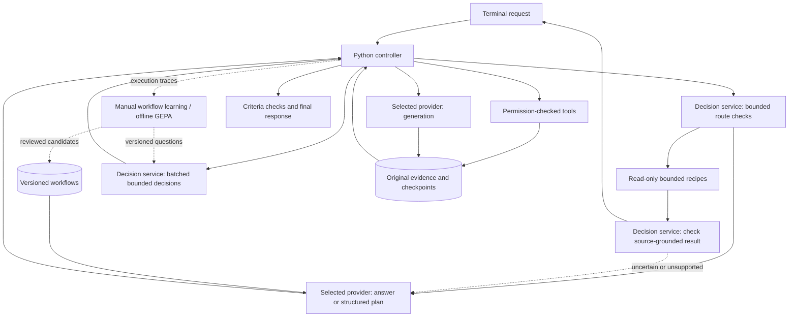

# Kestrel

A general-purpose terminal AI agent powered by your chosen model provider, with optional Jev assistance, reusable workflows and configurable permissions for coding, research, and everyday tasks.

```text
K E S T R E L / COMMAND DESK

Your model · Standard or Jev-assisted · Your execution backend

/setup        Configure models and execution
/skills       Discover task procedures
/workflow     Review and run saved plans
/connections  Connect browser and service tools
/memory       Inspect saved preferences and notes
```

Start with `kestrel setup`. See [setup and Docker](docs/SETUP.md), [portable skills](docs/SKILLS.md), [typed workflows](docs/WORKFLOW-TEMPLATES.md), [memory](docs/MEMORY.md), and [isolated browser tools](docs/BROWSER.md).

The terminal interface uses streamed activity, readable tool previews, Markdown responses, slash-command completion, a live status bar, and explicit permission prompts. It is inspired by familiar terminal assistants and has its own visual design.

**Status:** development build with owner-authorized live testing. The latest validation and live results are recorded in the benchmark reports. Quality and latency remain workload-dependent; general superiority over Codex is not established. See the [quality comparisons](benchmarks/QUALITY-PROFILES.md), [architecture measurements](benchmarks/ARCHITECTURE-FOUNDATIONS.md), [durable evidence results](benchmarks/DURABLE-EVIDENCE.md), [read scheduling checks](benchmarks/DEPENDENCY-SCHEDULING.md), [remaining architecture scope](docs/ARCHITECTURE-IMPLEMENTATION.md), and [manual acceptance guide](docs/TESTING.md).

## Install

Requires macOS or Linux, Python 3.11+, and [uv](https://docs.astral.sh/uv/). No local model weights are downloaded.

```sh
git clone https://github.com/itsflownium/Kestrel-Agent.git
cd Kestrel-Agent
bash scripts/install.sh
kestrel auth login
# Optional: kestrel mode jev
kestrel
```

Codex manages ChatGPT OAuth and token refresh. Existing sign-in is reused when available. Kestrel never extracts OAuth tokens or treats them as Platform API keys. The pinned official Python SDK includes its own Codex executable.

`kestrel auth jev` uses hidden terminal input and saves an owner-readable local secret file. Alternatively, set `TYPESAFE_API_KEY`. Never commit real keys or paste them into issues/PRs.

The installer adds `~/.local/bin/kestrel`. If needed, add `export PATH="$HOME/.local/bin:$PATH"` to your shell configuration. Installation does not run tests, sign in, or call models.

```sh
kestrel --workspace ~/Projects/example
kestrel resume SESSION_ID
```

## Providers and per-user sign-in

Inside Kestrel, use `/provider` or `/provider NAME` to select Codex, OpenAI, DeepSeek, Xiaomi MiMo, Anthropic, Moonshot/Kimi, GLM, Poolside, Groq, Mistral, OpenRouter, or a custom compatible server. Enter an endpoint and model ID where applicable. Startup and provider setup ask for missing provider keys, and for a Jev key only in Jev mode with hidden input (Enter skips); saved keys are reused. Model IDs are not hardcoded. `/model` shows the active provider/model and Jev key status; missing Jev credentials prompt for hidden input in Jev mode (Enter skips). `/model jev-key` replaces the Jev key, and `/model provider-key` saves the generation provider key.

Each person uses their own credentials:

- **Codex:** run `kestrel auth login` for the official per-user ChatGPT OAuth flow. Existing Codex sign-in is reused; no developer-owned shared token is distributed.
- **OpenAI-compatible:** configure the service's Chat Completions base URL and model ID, then use `/model provider-key` or `kestrel auth provider`. Local loopback servers can omit a key.
- **Anthropic:** select `anthropic`, a model ID available to your account, and your API key. This adapter uses the Messages API, not Claude consumer-account OAuth.
- **Jev:** each person supplies their own key through `/model` or `kestrel auth jev`.

For example, run `kestrel provider deepseek --model YOUR_MODEL_ID`, or use `/provider deepseek` inside Kestrel. `kestrel auth poolside` saves a Poolside key without changing your model. See [all provider presets, endpoints, and key setup](docs/PROVIDERS.md). Custom gateways and local compatible servers use the same adapter. APIs with a different protocol still need a separate adapter; support for every service/model is not claimed.

Provider keys are stored with owner-only permissions in `providers.json` under Kestrel's private data directory, scoped to provider and endpoint. The configured `provider_api_key_env` (default `KESTREL_MODEL_API_KEY`) can override a saved key. Never put an API key directly into `/model MODEL_ID` or a configuration value.

Advanced compatible-API settings: `provider_json_mode` accepts `prompt` (default), `json_object`, or `json_schema`; use only modes supported by your endpoint. Planning responses are always validated by Kestrel. `provider_token_parameter` selects `max_tokens` or `max_completion_tokens`; `provider_send_reasoning_effort=true` sends the configured effort to endpoints that support it. `provider_max_tokens` and `provider_timeout_seconds` bound responses. HTTP adapters buffer the final response rather than streaming tokens.

Generation, planning, workflow learning, and GEPA reflection use the selected provider. Standard mode uses the selected model for bounded decisions; Jev mode uses Jev. File tools, URL fetching and configured direct HTTP MCP connections work independently of the generation provider. Shell execution uses the selected Codex sandbox or Docker backend. Codex-native web research and Codex-configured MCP integrations require Codex; HTTP generation does not silently substitute Codex for them. The `network` setting controls task tools, not the explicitly configured model APIs.

Protocol adapters and controller dispatch have mocked tests; Anthropic/DeepSeek live calls have not been run because their credentials were not supplied. Official protocol references: [DeepSeek Chat Completions](https://api-docs.deepseek.com/api/create-chat-completion/), [Anthropic Messages](https://platform.claude.com/docs/en/api/messages/create).

## Architecture



- **The selected generation provider** creates plans, code, prose, and research when needed. Simple conversation can finish in one generation call followed by the selected decision service's answer review. Native web research requires Codex. The user selects a fixed provider/model; there is no learned model router.
- **The decision service** (Jev or the selected model) gates applicable fast paths, reviews direct answers, evaluates conditional action relevance, selects supplied candidates, checks explicit completion criteria, and judges whether final action claims match evidence. Independent questions are batched. Confidence is not treated as proof of correctness.
- **Fast paths** can finish bounded arithmetic, single-record selection, and grouped numeric queries over explicitly named small CSV/JSON files with zero generation calls in Jev mode. Arithmetic is computed locally after the selected decision service approves the route. Record candidates and output field choices are derived from the actual file schema; a second Jev check verifies selection and requested fields. Unsupported formats, ambiguity, ties, or failed checks fall back to the general agent. There are no benchmark-answer lookups. These limited recipes do not replace general generation or prove universal speed improvements.
- **The controller** validates dependency graphs and result bindings, enforces permissions, parallelizes independent reads, serializes writes, tracks budgets, and checkpoints operations. Jev cannot change permissions.
- **Result reuse and recovery** let Jev approve an exact tool-produced answer or command receipt without final generation, even when the planner omitted a reuse reference. Selection shares the completion-check call; unresolved work cannot bypass it. Rejected candidates fall back to generation, and revised final answers are checked again before return. Plans can branch on success or failure.
- **Tools** include file listing/search, text editing with content-hash protection, PDF/DOCX/XLSX reading, sandboxed commands, public URL fetching, Codex web research, and configured MCP tools. Complex artifact creation uses explicitly authorized commands and suitable libraries.
- **Memory** retains original evidence, bounded prompt excerpts, sessions, and parameterized workflow recipes in SQLite. `read_evidence` retrieves retained detail. Workflows supplement fresh planning rather than limiting task types.
- **GEPA** evaluates better prompt wording offline. It does not train model weights or run automatically.

See [implementation notes](docs/ARCHITECTURE.md) for boundaries and recovery behavior.

## Access and budgets

```sh
kestrel config show
kestrel config set permission '"read-only"'
kestrel config set permission '"workspace"'
kestrel config set readable_roots '["/absolute/reference-folder"]'
kestrel config set writable_roots '["/absolute/output-folder"]'
kestrel config set confirm_shell false
kestrel config set confirm_writes true
kestrel config set network false
kestrel config set max_model_calls 6
```

Default access permits edits within the selected workspace, asks before commands and connected actions, and allows network use. `full` removes command filesystem restrictions and requires `network=true`. Direct file tools reject known credential paths. Broad shell authorization is broad computer access, not a read allowlist.

Model-requested permission escalations are declined. Configure access through Kestrel. Unsupported MCP forms are declined; complete connector setup in its own client before use. Named tools can be allowed using `mcp_auto_allow`, e.g. `["calendar/list_events"]`. Unconnected accounts are unavailable.

Default per-request budgets: **6 Codex calls, 32 Jev calls, 24 actions, 15 minutes**, with `low` Codex effort. Subscription usage is reported separately from Jev tokens; no fictional per-request subscription dollar charge is shown.

## Terminal commands

| Command | Action |
| --- | --- |
| `/help` | Commands and key bindings |
| `/new` | Fresh conversation |
| `/sessions`, `/resume ID` | List/reopen sessions |
| `/continue` | Continue interrupted work |
| `/steer UPDATE` | Stop, save an update, and replan unfinished work while preserving its evidence and effect safeguards |
| `/cancel` | Stop active work without resuming; also works during an approval wait |
| `/jobs [show|cancel ID]` | Inspect or cancel background work; start it with `kestrel jobs start TASK -C WORKSPACE` |
| `/model`, `/model ID` | Model selection and Jev credential status |
| `/provider [NAME]` | Configure provider, endpoint, model, and missing keys |
| `/model jev-key`, `/model provider-key` | Hidden key entry |
| `/permissions [PROFILE]` | Inspect/change access |
| `/config` | Inspect settings |
| `/tools` | Discover configured MCP tools |
| `/status` | Checkpoint and usage |
| `/clear`, `/exit` | Clear display/exit |
| `Ctrl+C`, `Option+Enter` (Mac) / `Alt+Enter` | Stop active work, or exit when idle / insert newline (also Esc, then Enter) |

## Workflow memory and GEPA

```sh
kestrel workflows learn SESSION_ID
kestrel workflows list
kestrel workflows show WORKFLOW_ID
# After reviewing and testing:
kestrel workflows activate WORKFLOW_ID
kestrel workflows disable WORKFLOW_ID
```

Learned recipes retain their source session, hashes of the captured state and model-visible trace, recipe hash, and recorded completion-check outcomes. Failed/pending checks and unresolved actions prevent learning. These observations do not independently validate a reusable recipe. `show` exposes the provenance; `activate` enables **unverified planning guidance**, not automatic execution or behavioral certification. Older recipes without recorded provenance are explicitly labeled unverified.

The installer includes the learning extra. Minimal installs can use `uv pip install -e .` and add `.[learning]` later.

Datasets use JSONL rows with `state`, `question`, `options` (label-to-description object), and `expected` (one label). See `examples/decisions.jsonl`.

These commands make requests only when explicitly invoked:

```sh
kestrel eval examples/decisions.jsonl --component verify
kestrel optimize --train train.jsonl --validation validation.jsonl --test test.jsonl --component verify --budget 30
# Review the candidate; promotion checks the recorded independent evaluation:
kestrel promote-prompt /absolute/path/to/reviewed-candidate.json
```

Train, validation, and final-test sets must have disjoint inputs and task families. GEPA saves inactive candidates for review and never replays real shell/MCP actions. Its reflection callable uses the selected generation provider. Promotion preserves a previous prompt version.

## Storage

The installation target is below **3 GB**, including Python dependencies and the Codex binary. Managed storage is checked before checkpoints/tools, with a default ceiling of **2.8 GB** and a configuration maximum of **3 GB**. The installer removes its temporary download cache.

Data normally lives in `~/.local/share/kestrel`, honoring `XDG_DATA_HOME` or `KESTREL_HOME`. Credentials remain outside source code and task workspaces.

User projects, files produced by authorized programs, and existing shared Codex account data are outside the application quota. Kestrel cannot impose a hard disk quota on arbitrary programs. Captured results, excerpts, and managed writes are bounded.

```sh
kestrel doctor          # local inspection only
kestrel doctor --online # explicit authentication checks; no generation
```

## Development

```sh
uv sync --extra learning --extra dev
# Only when you choose to run tests:
uv run pytest
```

No automatic test CI is enabled. Live benchmarks run only when explicitly invoked.

MIT licensed. Kestrel is independent; Codex and Jev have their own access requirements and usage limits.


Prompt optimization requires three disjoint task-family splits. In addition to the evaluation fields above, each optimization row needs a nonempty `family` and a `label`: either `{"kind":"human","reviewer":"name","reason":"independent review"}` or `{"kind":"exact_match","actual":true,"expected":true,"on_match":"yes","on_mismatch":"no"}`. Exact-match labels are derived from supplied outcomes; Kestrel does not attest that the external oracle ran. Agent verdicts alone are not accepted as labels.

GEPA sees only training and validation data. After selecting a fixed prompt, Kestrel evaluates the baseline and candidate on the final test set. Test inputs and families are consumed once in the local store, including interrupted runs. Promotion requires the exact evaluated prompt and unchanged baseline, no validation accuracy regression, and no lost previously correct test example. Editing scores in candidate JSON cannot bypass the recorded evaluation. This is local experimental bookkeeping, not tamper-proof attestation or a guarantee of unseen-task quality. Backups preserve prior prompt text; activating a backup requires a new evaluation. Optimization never activates a prompt or trains model weights.


Execution plans can declare deterministic completion checks for exact result values, JSON output, and saved text/JSON artifacts. Kestrel evaluates these without another model call and retains failures across replanning and resume. Jev still checks original-task coverage and semantic correctness; a passing equality check alone does not prove the whole task is complete. File checks reread current artifacts through the existing path permissions. They accept complete UTF-8 text up to 40,000 characters and 1,000 lines; expected literals are limited to 4,000 characters, with at most 8 checks per plan and 16 retained per task. No generated verifier code runs. Checks reject ambiguous JSON duplicate keys and non-finite values, and distinguish booleans from numbers. A changed expectation requires a new user request; recovery may bind a result check to a new action without weakening its target.


## Agent modes

New installations start in **standard** mode: your chosen model handles generation and bounded decisions, with no Jev key or Jev API calls. Existing configurations without a mode field retain Jev mode. Use `/mode standard` or `/mode jev` in chat, or `kestrel mode standard` / `kestrel mode jev` in your shell. Jev mode privately asks for a missing Jev key; `/model jev-key` remains available in either mode.

Both modes preserve permissions, evidence, recovery, and deterministic completion checks. In standard mode, unconditional actions are already selected by the main planner and do not incur another model gate; actual runtime conditions still receive a bounded decision. Standard mode is not a direct-model passthrough and can make additional verification calls. Generation and model-decision budgets are separate (`max_model_calls`, `max_decision_calls`); telemetry distinguishes provider generation, provider decisions, and actual Jev calls. Explicit `eval`/`optimize` commands still evaluate Jev prompts regardless of agent mode. Provider-native research/MCP and terminal backend limitations above still apply.
