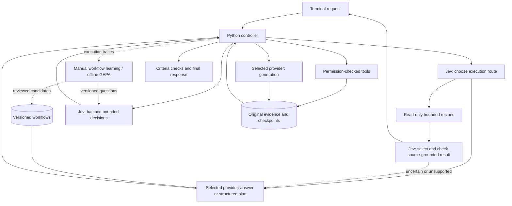

# Kestrel

A general-purpose terminal AI agent powered by your chosen generation provider and Jev, with reusable workflows and configurable permissions for coding, research, and everyday tasks.

```text
  ◇  K E S T R E L
     Think deeply. Move lightly.

  Codex plans & creates · Jev decides · You control access

  ❯ Find the documents relevant to this question and compare them.

  ◌ Codex · thinking
  → Plan ready
  ◇ Jev · 3 decisions
  ↳ read_file · Read the selected source
  ✓ source · completed

  ready │ Codex default + Jev │ workspace │ Ctrl+C stop · /help
```

The terminal interface uses streamed activity, readable tool previews, Markdown responses, slash-command completion, a live status bar, and explicit permission prompts. It is inspired by familiar terminal assistants and has its own visual design.

**Status:** initial implementation with limited owner-authorized testing. 71 offline checks pass; terminal startup/help/exit and live Codex/Jev task execution have been exercised. Jev-led bounded tasks are faster in the small comparison; overall superiority is not established. See the [general-task improvements](benchmarks/INITIAL-CONTEXT.md), [Jev table benchmarks](benchmarks/JEV-TABLES.md), [latest controller tests](benchmarks/RESULT-REUSE.md), [broader workload report](benchmarks/WORKLOADS.md), [next improvements](benchmarks/NEXT-STEPS.md), and [initial comparison report](benchmarks/README.md) and [manual acceptance guide](docs/TESTING.md).

## Install

Requires macOS or Linux, Python 3.11+, and [uv](https://docs.astral.sh/uv/). No local model weights are downloaded.

```sh
git clone https://github.com/itsflownium/Kestrel-Agent.git
cd Kestrel-Agent
bash scripts/install.sh
kestrel auth login
kestrel auth jev
kestrel
```

Codex manages ChatGPT OAuth and token refresh. Existing sign-in is reused when available. Kestrel never extracts OAuth tokens or treats them as Platform API keys. The pinned official Python SDK includes its own Codex executable.

`kestrel auth jev` uses hidden terminal input and saves an owner-readable local secret file. Alternatively, set `TYPESAFE_API_KEY`. Never commit real keys or paste them into issues/PRs.

The installer adds `~/.local/bin/kestrel`. If needed, add `export PATH="$HOME/.local/bin:$PATH"` to your shell configuration. Installation does not run tests, sign in, or call models.

```sh
kestrel --workspace ~/Projects/example
kestrel resume SESSION_ID
```

## Providers and per-user sign-in

Inside Kestrel, use `/provider` to select `codex`, `openai-compatible`, or `anthropic`, then enter an endpoint and model ID where applicable. Model IDs are not hardcoded. `/model` shows the active provider/model and Jev key status; missing Jev credentials prompt for hidden input (Enter skips). `/model jev-key` replaces the Jev key, and `/model provider-key` saves the generation provider key.

Each person uses their own credentials:

- **Codex:** run `kestrel auth login` for the official per-user ChatGPT OAuth flow. Existing Codex sign-in is reused; no developer-owned shared token is distributed.
- **OpenAI-compatible:** configure the service's Chat Completions base URL and model ID, then use `/model provider-key` or `kestrel auth provider`. Local loopback servers can omit a key.
- **Anthropic:** select `anthropic`, a model ID available to your account, and your API key. This adapter uses the Messages API, not Claude consumer-account OAuth.
- **Jev:** each person supplies their own key through `/model` or `kestrel auth jev`.

For example, DeepSeek documents an OpenAI-compatible endpoint at `https://api.deepseek.com`. Choose `openai-compatible` in `/provider`, enter that URL, and use a model ID from your provider account. Custom gateways and local compatible servers use the same adapter. APIs with a different protocol or authentication scheme still need a separate adapter; support for every service/model is not claimed.

Provider keys are stored with owner-only permissions in `providers.json` under Kestrel's private data directory, scoped to provider and endpoint. The configured `provider_api_key_env` (default `KESTREL_MODEL_API_KEY`) can override a saved key. Never put an API key directly into `/model MODEL_ID` or a configuration value.

Advanced compatible-API settings: `provider_json_mode` accepts `prompt` (default), `json_object`, or `json_schema`; use only modes supported by your endpoint. Planning responses are always validated by Kestrel. `provider_token_parameter` selects `max_tokens` or `max_completion_tokens`; `provider_send_reasoning_effort=true` sends the configured effort to endpoints that support it. `provider_max_tokens` and `provider_timeout_seconds` bound responses. HTTP adapters buffer the final response rather than streaming tokens.

Generation, planning, workflow learning, and GEPA reflection use the selected provider. Jev remains the decision provider. File tools and URL fetching are provider-independent; shell execution still uses the bundled Codex sandbox runtime. Native web research and the current MCP bridge are Codex-only; HTTP generation never silently substitutes Codex for these features. The `network` setting controls task tools, not the explicitly configured model APIs.

Protocol adapters and controller dispatch have mocked tests; Anthropic/DeepSeek live calls have not been run because their credentials were not supplied. Official protocol references: [DeepSeek Chat Completions](https://api-docs.deepseek.com/api/create-chat-completion/), [Anthropic Messages](https://platform.claude.com/docs/en/api/messages/create).

## Architecture



- **The selected generation provider** creates plans, code, prose, and research when needed. Simple conversation can finish in one generation call after Jev routing. Native web research requires Codex. The user selects a fixed provider/model; there is no learned model router.
- **Jev** routes every new request, evaluates conditional action relevance, selects supplied candidates, checks explicit completion criteria, and judges whether final action claims match evidence. Independent questions are batched. Confidence is not treated as proof of correctness.
- **Fast paths** can finish bounded arithmetic, single-record selection, and grouped numeric queries over explicitly named small CSV/JSON files with zero Codex calls. Arithmetic is computed locally after Jev routing. Record candidates and output field choices are derived from the actual file schema; a second Jev check verifies selection and requested fields. Unsupported formats, ambiguity, ties, or failed checks fall back to the general agent. There are no benchmark-answer lookups. These limited recipes do not replace general generation or prove universal speed improvements.
- **The controller** validates dependency graphs and result bindings, enforces permissions, parallelizes independent reads, serializes writes, tracks budgets, and checkpoints operations. Jev cannot change permissions.
- **Result reuse and recovery** let Jev approve an exact tool-produced answer without final generation, and let plans branch on success or failure. Checks retain execution evidence and fall back to generation when reuse is rejected.
- **Tools** include file listing/search, text editing with content-hash protection, PDF/DOCX/XLSX reading, sandboxed commands, public URL fetching, Codex web research, and configured MCP tools. Complex artifact creation uses explicitly authorized commands and suitable libraries.
- **Memory** retains original evidence, bounded prompt excerpts, sessions, and parameterized workflow recipes in SQLite. `read_evidence` retrieves retained detail. Workflows supplement fresh planning rather than limiting task types.
- **GEPA** evaluates better prompt wording offline. It does not train model weights or run automatically.

See [implementation notes](docs/ARCHITECTURE.md) for boundaries and recovery behavior.

## Access and budgets

```sh
kestrel config show
kestrel config set permission '"read-only"'
kestrel config set permission '"workspace"'
kestrel config set readable_roots '["/absolute/reference-folder"]'
kestrel config set writable_roots '["/absolute/output-folder"]'
kestrel config set confirm_shell false
kestrel config set confirm_writes true
kestrel config set network false
kestrel config set max_model_calls 6
```

Default access permits edits within the selected workspace, asks before commands and connected actions, and allows network use. `full` removes command filesystem restrictions and requires `network=true`. Direct file tools reject known credential paths. Broad shell authorization is broad computer access, not a read allowlist.

Model-requested permission escalations are declined. Configure access through Kestrel. Unsupported MCP forms are declined; complete connector setup in its own client before use. Named tools can be allowed using `mcp_auto_allow`, e.g. `["calendar/list_events"]`. Unconnected accounts are unavailable.

Default per-request budgets: **6 Codex calls, 32 Jev calls, 24 actions, 15 minutes**, with `low` Codex effort. Subscription usage is reported separately from Jev tokens; no fictional per-request subscription dollar charge is shown.

## Terminal commands

| Command | Action |
| --- | --- |
| `/help` | Commands and key bindings |
| `/new` | Fresh conversation |
| `/sessions`, `/resume ID` | List/reopen sessions |
| `/continue` | Continue interrupted work |
| `/model`, `/model ID` | Model selection and Jev credential status |
| `/provider` | Configure provider, endpoint, and model |
| `/model jev-key`, `/model provider-key` | Hidden key entry |
| `/permissions [PROFILE]` | Inspect/change access |
| `/config` | Inspect settings |
| `/tools` | Discover configured MCP tools |
| `/status` | Checkpoint and usage |
| `/clear`, `/exit` | Clear display/exit |
| `Ctrl+C`, `Alt+Enter` | Stop active work/insert newline |

## Workflow memory and GEPA

```sh
kestrel workflows learn SESSION_ID
kestrel workflows list
kestrel workflows show WORKFLOW_ID
# After reviewing and testing:
kestrel workflows activate WORKFLOW_ID
kestrel workflows disable WORKFLOW_ID
```

The installer includes the learning extra. Minimal installs can use `uv pip install -e .` and add `.[learning]` later.

Datasets use JSONL rows with `state`, `question`, `options` (label-to-description object), and `expected` (one label). See `examples/decisions.jsonl`.

These commands make requests only when explicitly invoked:

```sh
kestrel eval examples/decisions.jsonl --component verify
kestrel optimize --train train.jsonl --validation validation.jsonl --component verify --budget 30
# Evaluate separately on held-out examples before activation:
kestrel promote-prompt /absolute/path/to/reviewed-candidate.json
```

Train/validation sets must not overlap. GEPA saves inactive candidates for review and never replays real shell/MCP actions. Its reflection callable uses the selected generation provider. Promotion preserves a previous prompt version.

## Storage

The installation target is below **3 GB**, including Python dependencies and the Codex binary. Managed storage is checked before checkpoints/tools, with a default ceiling of **2.8 GB** and a configuration maximum of **3 GB**. The installer removes its temporary download cache.

Data normally lives in `~/.local/share/kestrel`, honoring `XDG_DATA_HOME` or `KESTREL_HOME`. Credentials remain outside source code and task workspaces.

User projects, files produced by authorized programs, and existing shared Codex account data are outside the application quota. Kestrel cannot impose a hard disk quota on arbitrary programs. Captured results, excerpts, and managed writes are bounded.

```sh
kestrel doctor          # local inspection only
kestrel doctor --online # explicit authentication checks; no generation
```

## Development

```sh
uv sync --extra learning --extra dev
# Only when you choose to run tests:
uv run pytest
```

No automatic test CI is enabled. Live benchmarks run only when explicitly invoked.

MIT licensed. Kestrel is independent; Codex and Jev have their own access requirements and usage limits.
