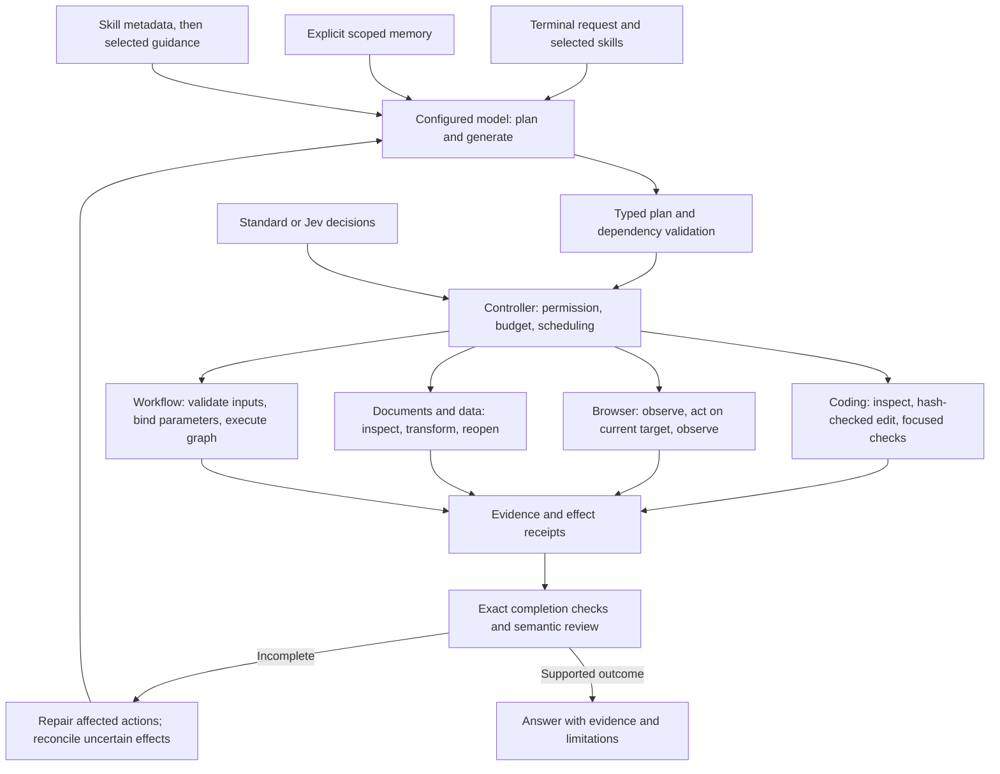

# Task-specific execution on a shared controller

Kestrel uses one provider-neutral controller, with task-specific tools and skill procedures. Jev is an optional decision component; it does not replace generation, execute tools, grant permissions, or provide evidence by itself.

## Existing enforcement and limits

| Path | Enforced mechanism | Remaining gap |
| --- | --- | --- |
| Shared controller | Typed tool arguments, permissions, bounded plans and model usage, durable observations, completion contracts, uncertain-effect reconciliation | Broad held-out comparisons; more provider conformance coverage |
| Coding | Source hashes for overwrites, dependency references, command receipts and exact artifact/result checks | The planner must choose useful tests; a zero exit code alone cannot establish task quality |
| Browser | Isolated browser context, observation tokens, current-target validation, token consumption before effects, new snapshot after action | Nested/cross-origin DOM frames and stable canvas point clicks are exercised; native desktop and broad authenticated-session coverage remain unverified |
| Documents/data | Typed table and file tools, bounded reads, hash-aware writes, artifact checks | Rendering and deeper semantic checks depend on available tools and the chosen plan |
| Workflows | Typed template inputs, structured substitution, dependency validation, normal permission/evidence path | Behavioral certification and promotion on unseen parameters are still pending |
| Skills | Local provenance, bounded discovery, prerequisite reporting, on-demand guidance, explicit invocation | Guidance is not executable enforcement; format validation is not a quality benchmark |

Task-specific procedures live in focused skills rather than a growing universal prompt. The skill library is a discovery interface; opening a preview does not execute its instructions. Local and external content remain evidence, not authority to change the user's task.

## Next architecture gates

1. A short observe/act/check loop has been compared with the plan graph on two matched dynamic-browser variants: both passed 2/2, with fewer calls and lower observed time for the one-action policy. See [the assessment](../benchmarks/INCREMENTAL-LOOP-SEP22.md). The graph remains the default; one task family is insufficient for promotion across coding and general work.
2. An experimental app-scoped macOS Accessibility action adapter exists; live native validation remains blocked on permission. Image transport/inspection is now implemented (see VISION.md); only a successful image-input call supports a visual interpretation. A text-only model must not receive a claim that it saw an image.
3. Certify workflow/skill revisions using isolated fixtures, unseen inputs, and effect-state oracles before describing them as reliable reusable automation.
4. Compare quality on coding, browser, research, documents/data, and recovery separately. Preserve failures and tool-setup exclusions. No architecture or skill count proves superiority over another agent.
